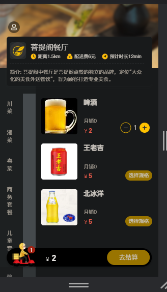

# Food Delivery App

This is a Food Delivery App that allows users to order food online and restaurant owners to manage their restaurant operations.

## Features

### For Users

- **User Registration**: Users can create an account to start using the app.
- **Browse Dishes**: Users can browse a variety of dishes offered by the restaurant.
- **Place Orders**: Users can select dishes, add them to their cart, and place orders.
- **Order Management**: Users can view their order history and current order status.
- **Profile Management**: Users can manage their personal information and delivery addresses.

### For Restaurant Owners (Admin Dashboard)

- **Employee Management**: Restaurant owners can add and manage employees.
- **Categories Management**: Manage dish and set categories.
- **Dish Management**: Create and modify dishes.
- **Dish Sets Management**: Create and modify dish sets or combos.
- **Order Management**: View and manage incoming orders.

## Technologies Used
- spring Boot
- MyBatis Plus
- Lombok
- MySQL
- Redis
- Spring Cache
- Vue.js